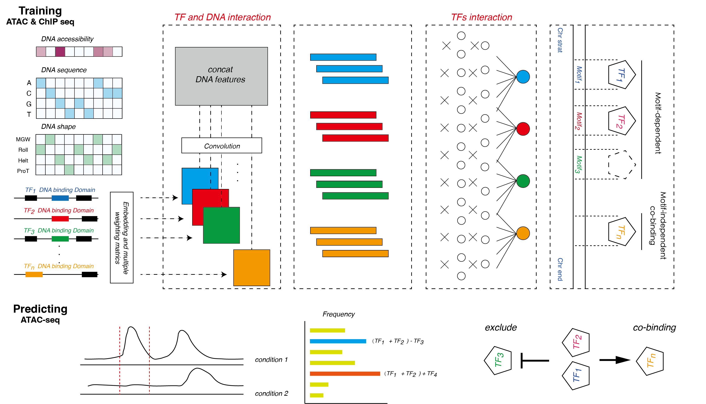

### TFNet

*Aim to decipher the interactions of transcriptional factors (TFs) bewteen co-binding and rejection by deep learning model.*

*TFNet integrate two core module 'TF and DNA interaction' and 'TFs interaction', which learning the pattern of TFs binding. In addition, the common used method - motif scan were applied to infer the motif-dependent TFs for further analysis* 

### Workflow



### for preprocess chip-seq data
python preprocess.py -d configure/data.yaml -m configure/tfnet.yaml


### for TFNet Training and Testing

```
python main.py -d configure/data.yaml -m configure/tfnet.yaml --mode train -n 5 # train and evaluation on independent test set
python main.py -d configure/data.yaml -m configure/tfnet.yaml --mode eval -n 5 # evaluate on test set
python main.py -d configure/data.yaml -m configure/tfnet.yaml --mode predict -n 5 # predict on independent data set

python main.py -d configure/data.yaml -m configure/tfnet.yaml --mode 5cv # 5 cross-validation
python main.py -d configure/data.yaml -m configure/tfnet.yaml --mode lomo # leave one data out cross-validation
```


### for Baseline Model Testing

```
python baseline.py configure/data.yaml
```

