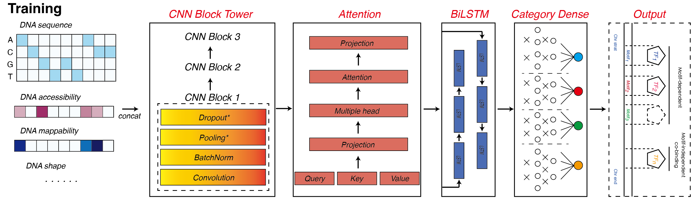
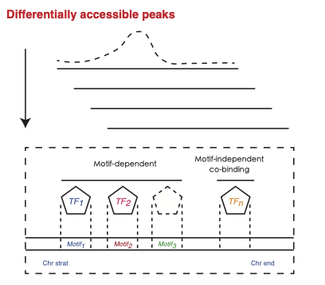

## TFNet

*Aim to decipher the interactions of transcriptional factors (TFs) bewteen co-binding and rejection by deep learning model.*

*TFNet integrate two core module 'TF and DNA interaction' and 'TFs interaction', take account of Chromatin accessibility and DNA sequence information to learn the pattern of TFs binding. In addition, the common used method - motif scan were applied to infer the motif-dependent TFs for further analysis* 

## Workflow




### Genomic sequence data

```
# Genome size of each chromosome, may need to filter some chrom in the hg38.chrom.sizes.reduced
samtools faidx data/genome/genome.fa
cut -f 1,2 data/genome/genome.fa.fai > data/hg38.chrom.sizes.reduced
```
Genomic sequence is provided as fasta format. You can download these files from [here](https://hgdownload.soe.ucsc.edu/downloads.html)
blacklist can be downloaded from [here](https://github.com/Boyle-Lab/Blacklist/blob/master/lists/)


### for preprocessing Chromatin accessibility data

```
# If you have replicates for the same cell type, you should first merge them with samtools
samtools merge -o merge.bam rep1.bam rep2.bam
samtools index merge.bam
# run the bamCoverage in deeptools to generate the required .bw file 
bamCoverage --bam merge.bam -o merge.bw -p 4 --binSize 1 --normalizeUsing RPGC --effectiveGenomeSize 2864785220 --ignoreForNormalization chrX chrM 
```
effectiveGenomeSize can be found [here](https://deeptools.readthedocs.io/en/latest/content/feature/effectiveGenomeSize.html)


### for preprocessing chip-seq data

```
# need .bed file and chip.txt contain the file and name of all tfs
ls data/tf_chip/*bed.gz | awk -F '\_|\.' '{OFS="\t"}{print $0,$2}' > data/tf_chip/chip.txt
python preprocess_data.py -d configure/data.yaml -m configure/tfnet.yaml
```

### adjust model config file to select Model structure and set classweights

### for TFNet Training and Testing

```
python main.py -d configure/data.yaml -m configure/tfnet.yaml --mode train -n 5
python main.py -d configure/data.yaml -m configure/tfnet.yaml --mode eval -n 5 # evaluate on test set
python main.py -d configure/data.yaml -m configure/tfnet.yaml --mode predict -n 5 # predict on independent data set
python main.py -d configure/data.yaml -m configure/tfnet.yaml --mode 5cv # 5 cross-validation
python main.py -d configure/data.yaml -m configure/tfnet.yaml --mode lomo # leave one data out cross-validation

# continue to train
python main.py -d configure/data.yaml -m configure/tfnet.yaml --mode train -n 5 -c

# split large training dataset for training #
# split 

# train_prefix in data.yaml
gunzip -c data_train.txt.gz
split -l n -d -a 2 data_train.txt data_train_mini_ # where n is the number of lines in each file, 230000 
gzip data_train_mini_*
# train
python main_split.py -d configure/data.yaml -m configure/tfnet.yaml --mode train -n 5
```

### for TFNet Eval
```
using test and bigwig_file list in data.yaml and eval_list mode, for batch eval on different datasets
test_list: [ 'data/tf_chip/H1_test/data_train_mini2_an.gz', 'data/tf_chip/H1_test/data_train_mini2_ao.gz']
bigwig_file_list: [['./data/atac/grch38/H1.bigWig'], ['./data/atac/grch38/H1.bigWig']]

python main.py -d configure/data.yaml -m configure/tfnet3.yaml --mode eval_list -n 1

```